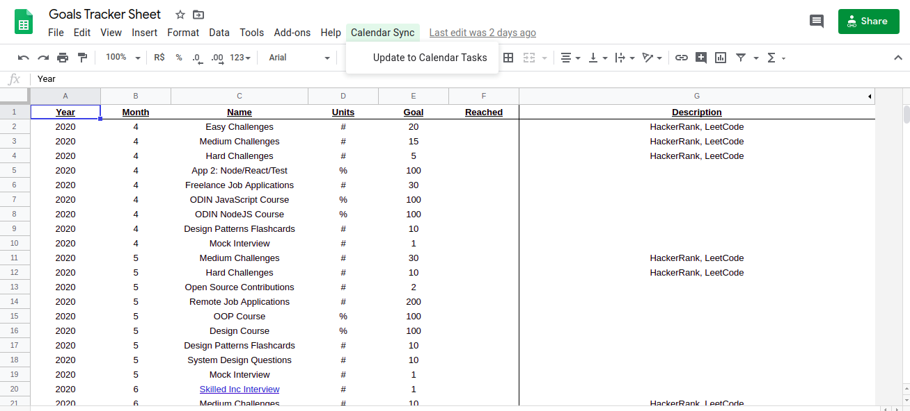

# Goals Tracker Sheet 
### Currently it's a Google Sheet that breaks down your monthly goals into weekly goals and automatically adds them to a "Goals" list on Google Tasks.

## Open Source Mission
The vision for this project is to become a full fledged goal tracking solution entirely based in Google products. We welcome new collaborators with all skill levels, this project started as a learning experience and there's still a lot to be done and learned.

## Features to be Developed - Pick your ticket or Get in touch through e-mail.
- Checking off the task updates the spreadsheet.
- Create a "Project View" to track each goal's progress (see links below).

* These projects served as inspiration for this one. Using one of them as the frontend for this Sheets/Tasks/Calendar backend would be awesome. Let's not reinvent the wheel and let's use and credit these great open source repos.
   - [Flow Dashboard (React/Python/GCP)](https://github.com/onejgordon/flow-dashboard)
   - [Loop Habits (Java/Android)](https://github.com/iSoron/uhabits)

## Installation

- Copy this [Sheet](https://docs.google.com/spreadsheets/d/1MrdkS6aBCU6Q-snaFygQkoaAri-6_kTrHvZAgO0rmOk/edit?usp=sharing) to your Google Drive.
- Code on the Script Editor or on [sheet_to_cal.js](src/sheet_to_cal.js).

## Usage example

- Write down your monthly goals
- Click on the "Calendar Sync Menu" > "Update to Calendar Tasks"

## Development setup

[Amit Agarwal's](https://www.labnol.org/about/) starter kit is being in used in this project. 
...currently being poorly used. But I'd be glad if someone helped set things up for a better development experience.

- All development so far is happening on [sheet_to_cal.js](src/sheet_to_cal.js)

## Contributors

[Marcos Cannabrava](https://www.linkedin.com/in/marcos-cannabrava/) – mpcannabrava@gmail.com

Distributed under the MIT license. See ``LICENSE`` for more information.

## Contributing

1. Fork it (<https://github.com/yourname/yourproject/fork>)
2. Create your feature branch (`git checkout -b feature/fooBar`)
3. Commit your changes (`git commit -am 'Add some fooBar'`)
4. Push to the branch (`git push origin feature/fooBar`)
5. Create a new Pull Request